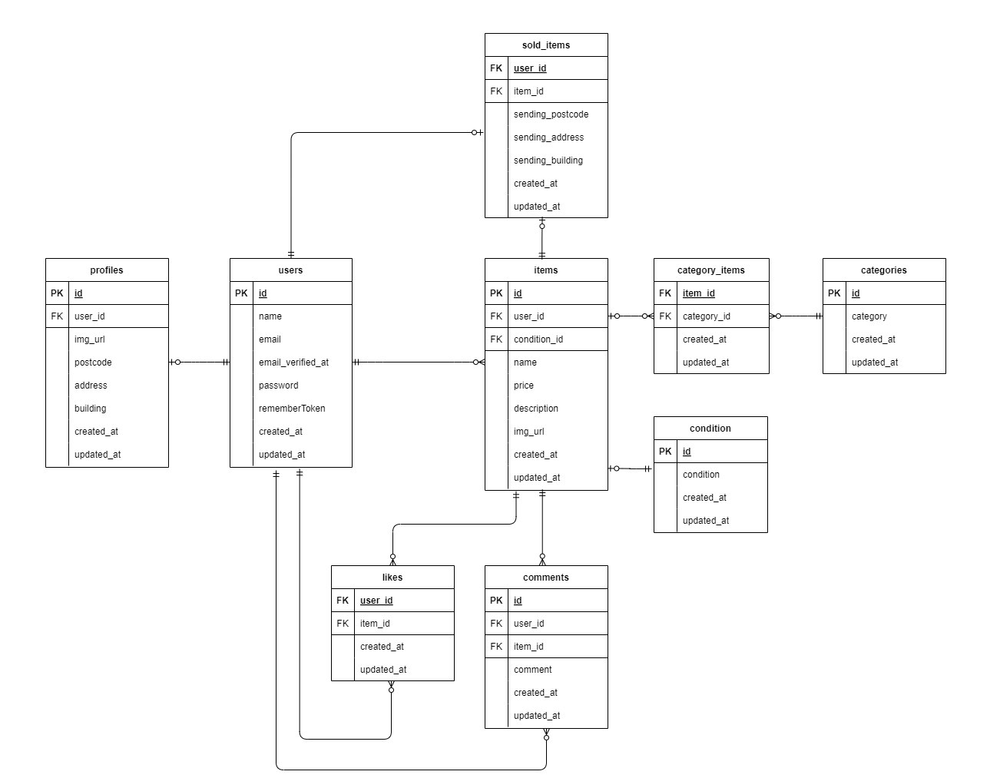

# 勤怠管理システム

## 環境構築

1. Dockerを起動する

2. プロジェクト直下で、以下のコマンドを実行する

```
make init
```

※Makefileは実行するコマンドを省略することができる便利な設定ファイルです。コマンドの入力を効率的に行えるようになります。<br>

## メール認証
開発環境ではメール確認用に Mailpit を使用しています。
プロジェクト起動後、ブラウザで以下のURLにアクセスすると、システムから送信されたメール（会員登録時の認証メール等）を確認できます。

http://localhost:8025

.envファイルの設定は以下の通りにしてください：

MAIL_MAILER=smtp
MAIL_HOST=mailpit
MAIL_PORT=1025
MAIL_USERNAME=null
MAIL_PASSWORD=null
MAIL_ENCRYPTION=null
MAIL_FROM_ADDRESS=admin@example.com
MAIL_FROM_NAME="${APP_NAME}"

以下のリンクは公式ドキュメントです。<br>
https://docs.stripe.com/payments/checkout?locale=ja-JP
## テーブル仕様
### usersテーブル
| カラム名 | 型 | primary key | unique key | not null | foreign key |
| --- | --- | --- | --- | --- | --- |
| id | bigint | ◯ |  | ◯ |  |
| name | varchar(255) |  |  | ◯ |  |
| email | varchar(255) |  | ◯ | ◯ |  |
| password | varchar(255) |  |  | ◯ |  |
| role | int |  |  | ◯ |  |0:一般, 1:管理者
| created_at | timestamp |  |  |  |  |
| updated_at | timestamp |  |  |  |  |

### attendancesテーブル
| カラム名 | 型 | primary key | unique key | not null | foreign key |
| --- | --- | --- | --- | --- | --- |
| id | bigint | ◯ |  | ◯ |  |
| user_id | bigint |  |  | ◯ | users(id) |
| date | date |  |  | ◯ |  |
| punch_in | time |  |  | ◯ |  |
| punch_out | time |  |  |  |  |
| break_in | time |  |  |  |  |
| break_out | time |  |  |  |  |
| break2_in | time |  |  |  |  |
| break2_out | time |  |  |  |  |

### attendance_correct_requestsテーブル
| カラム名 | 型 | primary key | unique key | not null | foreign key |
| --- | --- | --- | --- | --- | --- |
| id | bigint | ◯ |  | ◯ |  |
| attendance_id | bigint |  |  | ◯ | attendances(id) |
| user_id | bigint |  |  | ◯ | users(id) |
| punch_in | time |  |  | ◯ |  |
| punch_out | time |  |  | ◯ |  |
| break_in | time |  |  |  |  |
| break_out | time |  |  |  |  |
| break2_in | time |  |  |  |  |
| break2_out | time |  |  |  |  |
| remark | text |  |  | ◯ |  |
| status | int |  |  | ◯ |  |

## ER図


##テストアカウント
本システムには「管理者」と「一般ユーザー」の2つの権限があります。

管理者
email: admin@example.com
password: password
role: 1

一般スタッフ
email: staff@example.com
password: password
role: 0

※ php artisan db:seed を実行することで、上記アカウントが作成されます。

## PHPUnitを利用したテストに関して
システム全体の整合性を確認するために、以下のコマンドでテストを実行できます。
php artisan test

//テスト用データベースの作成
docker-compose exec mysql bash
mysql -u root -p
//パスワードはrootと入力
create database test_database;

docker-compose exec php bash
php artisan migrate:fresh --env=testing
./vendor/bin/phpunit