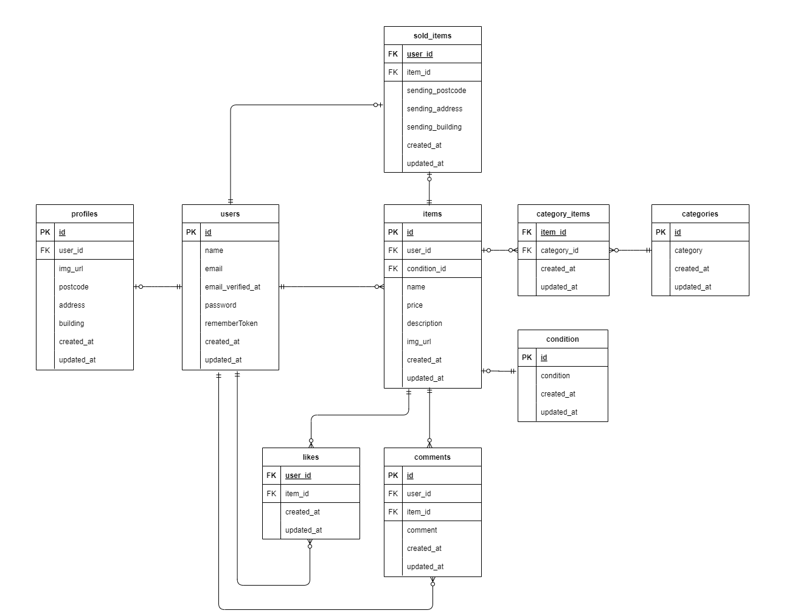

# 勤怠管理アプリ

Laravel 8 で構築した勤怠管理アプリケーションです。一般ユーザーの打刻・勤怠修正申請と、管理者による勤怠確認・修正申請の承認・CSV 出力に対応しています。

## 主な機能

- 一般ユーザーの会員登録・ログイン・メール認証
- 出勤／退勤、休憩開始／終了の打刻
- 月別勤怠一覧・勤怠詳細の表示
- 勤怠修正申請と申請一覧の確認
- 管理者ログイン、全勤怠・スタッフ別勤怠の確認
- 修正申請の承認とスタッフ別勤怠 CSV 出力

## 使用技術

- PHP 8.x / Laravel 8
- MySQL 8.0
- Nginx 1.21
- Docker Compose
- Mailpit（開発用メール受信）

## 環境構築

Docker ビルド

1. git clone git@github.com:toomochin/attendance-app.git
2. docker-compose up -d --build

Lavaral 環境構築
1.docker-compose exec php bash
2.composer install
3.cp .env.example .env
4..env ファイルの変更

```
　DB_HOSTをmysqlに変更
　DB_DATABASEをlaravel_dbに変更
　DB_USERNAMEをlaravel_userに変更
　DB_PASSWORDをlaravel_passに変更
　MAIL_FROM_ADDRESSに送信元アドレスを設定
```

5.php artisan key:generate
6.php artisan migrate
7.php artisan db:seed
8.php artisan test

## メール認証

開発環境ではメール確認用に Mailpit を使用しています。`.env` を次のように設定してください。

```dotenv
MAIL_MAILER=smtp
MAIL_HOST=mailpit
MAIL_PORT=1025
MAIL_FROM_ADDRESS=admin@example.com
```

会員登録後に送信される認証メールは、[Mailpit](http://localhost:8025) で確認できます。

## データベース概要

| テーブル                      | 用途                                                                  |
| ----------------------------- | --------------------------------------------------------------------- |
| `users`                       | ユーザー情報。`role` は一般ユーザー（0）または管理者（1）を表します。 |
| `attendances`                 | 日別の出退勤・休憩打刻情報。                                          |
| `attendance_correct_requests` | 勤怠修正申請と承認ステータス。                                        |

## ER 図



### users テーブル

| カラム名   | 型           | primary key | unique key | not null | foreign key | 備考               |
| ---------- | ------------ | ----------- | ---------- | -------- | ----------- | ------------------ |
| id         | bigint       | ◯           |            | ◯        |             |                    |
| name       | varchar(255) |             |            | ◯        |             |                    |
| email      | varchar(255) |             | ◯          | ◯        |             |                    |
| password   | varchar(255) |             |            | ◯        |             |                    |
| role       | tinyint      |             |            | ◯        |             | 0: 一般、1: 管理者 |
| created_at | timestamp    |             |            |          |             |                    |
| updated_at | timestamp    |             |            |          |             |                    |

### attendances テーブル

| カラム名       | 型           | primary key | unique key | not null | foreign key |
| -------------- | ------------ | ----------- | ---------- | -------- | ----------- |
| id             | bigint       | ◯           |            | ◯        |             |
| user_id        | bigint       |             |            | ◯        | users(id)   |
| date           | date         |             |            | ◯        |             |
| punch_in       | time         |             |            |          |             |
| punch_out      | time         |             |            |          |             |
| break_in       | time         |             |            |          |             |
| break_out      | time         |             |            |          |             |
| break2_in      | time         |             |            |          |             |
| break2_out     | time         |             |            |          |             |
| remark         | text         |             |            |          |             |
| request_status | varchar(255) |             |            |          |             |
| created_at     | timestamp    |             |            |          |             |
| updated_at     | timestamp    |             |            |          |             |

### attendance_correct_requests テーブル

| カラム名      | 型        | primary key | unique key | not null | foreign key     |
| ------------- | --------- | ----------- | ---------- | -------- | --------------- |
| id            | bigint    | ◯           |            | ◯        |                 |
| attendance_id | bigint    |             |            | ◯        | attendances(id) |
| user_id       | bigint    |             |            | ◯        | users(id)       |
| punch_in      | time      |             |            | ◯        |                 |
| punch_out     | time      |             |            |          |                 |
| break_in      | time      |             |            |          |                 |
| break_out     | time      |             |            |          |                 |
| break2_in     | time      |             |            |          |                 |
| break2_out    | time      |             |            |          |                 |
| remark        | text      |             |            | ◯        |                 |
| status        | int       |             |            | ◯        |                 |
| created_at    | timestamp |             |            |          |                 |
| updated_at    | timestamp |             |            |          |                 |

## 初期アカウント

`make init` または `make fresh` 実行時に、以下のアカウントが作成されます。パスワードはすべて `password` です。

| 種別           | メールアドレス     | パスワード |
| -------------- | ------------------ | ---------- |
| 管理者         | admin@gmail.com    | password   |
| 一般ユーザー 1 | general1@gmail.com | password   |
| 一般ユーザー 2 | general2@gmail.com | password   |

管理者は http://localhost/admin/login からログインします。

## テストの実行

テスト用データベースを作成してから、PHP コンテナ内でテストを実行します。

```bash
# テスト用データベースの作成（初回のみ）
docker-compose exec mysql mysql -u root -p -e "CREATE DATABASE IF NOT EXISTS test_database;"
# パスワードは root を入力

# テストの実行
docker-compose exec php php artisan test
```

## ディレクトリ構成

```text
.
├── docker/              # PHP・Nginx・MySQL の Docker 設定
├── src/                 # Laravel アプリケーション
│   ├── app/             # コントローラー、モデルなど
│   ├── database/        # マイグレーション、シーダー
│   ├── resources/views/ # Blade テンプレート
│   └── tests/           # Feature / Unit テスト
├── docker-compose.yml
└── Makefile
```
